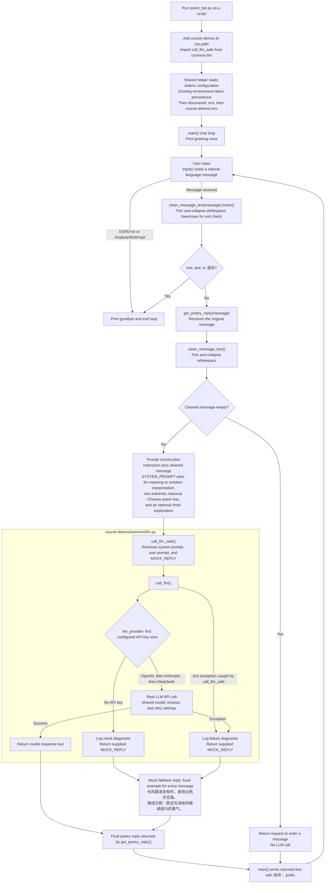

# Session 1 — Architecture from the implementation

Based on `poem_bot.py` and the shared functions it calls in `../course-demos/common/llm.py`.

The model is asked to choose an appropriate authentic poem, but the code does not validate its response. Each call uses only the current message; the loop does not store conversation history. The mock is a fixed offline example, not an emotion-based selection.

## Differences from design.md

- The implementation has a repeating `main()` chat loop, exit commands, and EOF/keyboard-interrupt handling; the original diagram shows only a single input-to-reply flow.
- Cleaning happens twice for ordinary messages: once for the exit check and once inside `get_poetry_reply()`. Blank messages return a reminder without calling the LLM.
- `get_poetry_reply()` builds the user prompt and passes it with `SYSTEM_PROMPT` and the fixed `MOCK_REPLY` to the shared helper.
- `call_llm_safe()` wraps `call_llm()`. Missing keys trigger the mock inside `call_llm()`; exceptions trigger the wrapper's fallback.
- Provider selection checks configured keys in OpenAI → Anthropic → DeepSeek order, rather than testing actual API availability. Anthropic is not mentioned in the original configuration node.
- Configuration also includes the existing environment and a discovered `.env`. `.env.example` is a setup template, not a file read at runtime, so it is omitted from the generated flow.
- The poetry format and emotional relevance are prompt instructions, with no output validation. The offline reply always uses the same poem and explanation.
